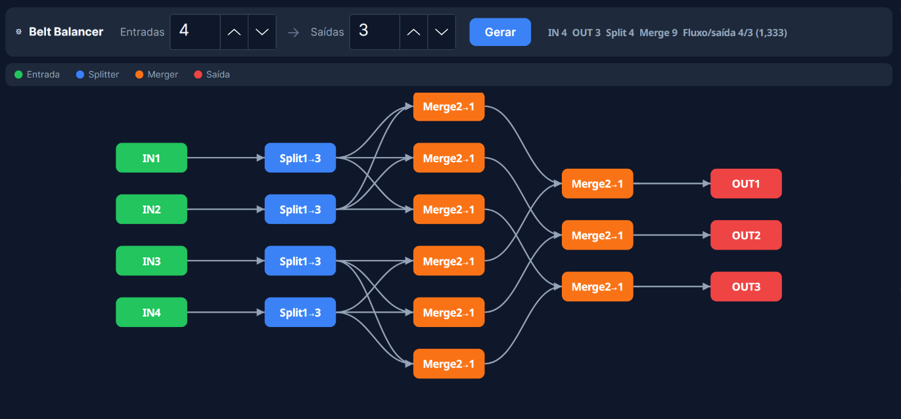

# Satisfactory Belt Balancer

Gerador de redes de **splitters e mergers** para o jogo [Satisfactory](https://www.satisfactorygame.com/).

Dado N entradas e M saídas, calcula automaticamente a topologia mínima de divisores e mescladores para distribuir o fluxo de forma perfeitamente igual entre todas as saídas.



## Como funciona

O algoritmo usa **Expand-and-Merge**:

1. Encontra o menor K = múltiplo de LCM(N, M) tal que K/N seja da forma 2ᵃ×3ᵇ
2. Constrói uma **árvore de split** recursiva (apenas divisores 1→2 e 1→3)
3. Constrói uma **árvore de merge** que agrupa os K fluxos em M saídas

> Alguns pares (N, M) são impossíveis — por exemplo, 17→5 —  
> quando LCM/N tem fatores primos diferentes de 2 e 3. O programa avisa.

## Instalação (Fedora / Linux)

### Dependência

```bash
sudo dnf install dotnet-sdk-8.0
```

### Instalar

```bash
git clone https://github.com/GabrielVascon/satisfactory-balancer.git
cd satisfactory-balancer
./install.sh
```

Pronto. Procure por **"Satisfactory Balancer"** no menu de aplicativos do GNOME.

### Executar sem instalar

```bash
dotnet run --project SatisfactoryBalancer.Avalonia/SatisfactoryBalancer.Avalonia.csproj
```

## Tecnologias

- **C# 12 / .NET 8** — 100% C#, sem HTML ou JavaScript
- **Avalonia UI 12** — UI desktop nativa (Linux, Windows, macOS)
- **DDD** — domínio isolado em `SatisfactoryBalancer/Domain/`

## Estrutura

```
SatisfactoryBalancer/          ← Domain library (algoritmos, value objects)
  Domain/
    Algorithms/                ← LcmExpander, SplitTreeBuilder, MergeTreeBuilder
    Services/                  ← BalancerGenerator
    ValueObjects/              ← FlowFraction (aritmética racional exata)
    Aggregates/                ← BalancerNetwork

SatisfactoryBalancer.Avalonia/ ← App desktop (Avalonia UI)
  Controls/BalancerCanvas.cs   ← Canvas customizado com pan e zoom
  Services/NetworkLayout.cs    ← Layout BFS + heurística baricêntrica
  MainWindow.axaml             ← Janela principal
```
